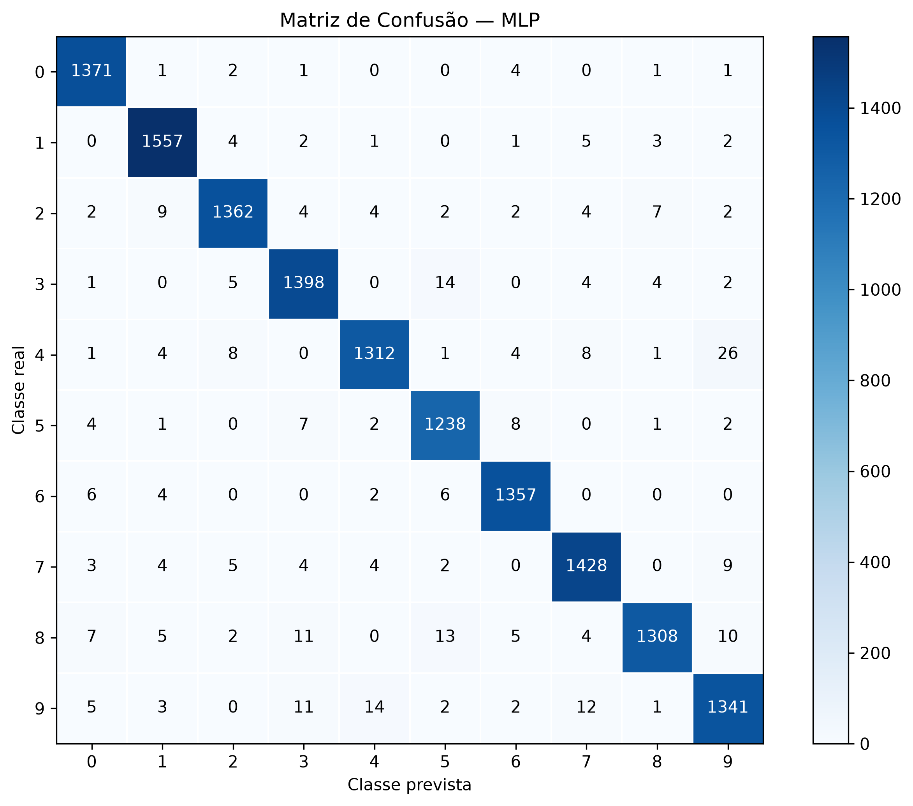
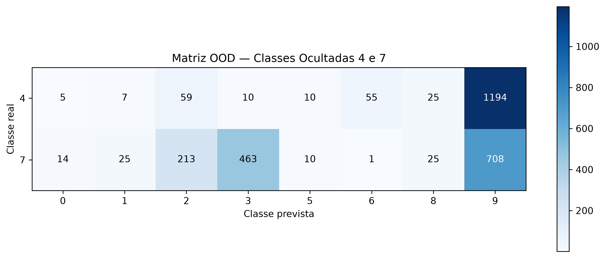

# 🔢 MNIST Model Benchmark

Projeto de Machine Learning desenvolvido para comparar diferentes modelos de **classificação multiclasse de dígitos manuscritos**, utilizando o dataset MNIST.

A solução implementa um pipeline completo de análise preditiva, desde a exploração e preparação dos dados até o treinamento, avaliação e comparação de modelos. O projeto também investiga a **robustez do modelo diante de classes desconhecidas** e sua capacidade de generalização para imagens produzidas fora do dataset original.

**Problema:** classificação automática de dígitos manuscritos de 0 a 9.  
**Dataset:** MNIST — 70.000 imagens.  
**Modelos avaliados:** Random Forest, SVM e MLP.  
**Melhor modelo:** MLP.  
**Accuracy no teste:** 97,66%.  
**Weighted F1-Score:** 97,66%.  
**Testes automatizados:** 17 aprovados.

---

## 🎯 Problema que o Projeto Resolve

O reconhecimento de dígitos manuscritos é um problema clássico de **Visão Computacional e Machine Learning**.

O objetivo deste projeto é responder à seguinte questão:

> É possível treinar um modelo capaz de identificar corretamente um dígito manuscrito a partir apenas dos valores dos pixels de sua imagem?

Além da classificação convencional, o projeto investiga outra questão relevante:

> O que acontece quando um modelo recebe uma classe que nunca esteve presente durante seu treinamento?

Para responder a essas questões, diferentes algoritmos são treinados, ajustados e comparados utilizando o mesmo problema de classificação.

Posteriormente, duas classes são completamente ocultadas do treinamento e apresentadas novamente ao modelo em um experimento **Out-of-Distribution (OOD)**.

Por fim, o modelo vencedor é testado com imagens externas do dígito 4 produzidas de diferentes maneiras, permitindo observar sua capacidade de generalização fora do domínio original do MNIST.

---

## 📌 Escopo do Projeto

O projeto contempla:

- análise exploratória do dataset MNIST;
- análise da distribuição das dez classes;
- visualização de exemplos dos dígitos;
- divisão estratificada dos dados;
- normalização dos pixels;
- transformação das imagens 28 × 28 em vetores de 784 características;
- treinamento de Random Forest, SVM e MLP;
- ajuste e comparação de hiperparâmetros;
- avaliação independente no conjunto de teste;
- análise por Accuracy, Precision, Recall e F1-Score;
- geração de matrizes de confusão;
- identificação das principais confusões entre dígitos;
- Class Masking com ocultação das classes 4 e 7;
- avaliação Out-of-Distribution;
- análise de confiança e overconfidence;
- inferência com imagens manuscritas externas;
- persistência dos modelos e resultados;
- logging dos principais experimentos;
- testes automatizados com Pytest.

---

## 🗂️ Dataset MNIST

O MNIST contém:

```text
70.000 imagens
10 classes
28 × 28 pixels por imagem
```

As classes representam os dígitos:

```text
0 1 2 3 4 5 6 7 8 9
```

Cada imagem originalmente possui dimensão:

```text
28 × 28
```

Para utilização nos modelos empregados neste projeto, cada imagem é transformada em um vetor:

```text
28 × 28 = 784 características
```

Os pixels originalmente possuem valores entre:

```text
0 e 255
```

Durante o pré-processamento, são normalizados para o intervalo:

```text
0 a 1
```

---

## 🔄 Como a Solução Funciona

O pipeline desenvolvido segue cinco fases principais:

```text
             MNIST — 70.000 imagens
                       │
                       ▼
              ┌─────────────────┐
              │ 1. Exploração   │
              │      EDA        │
              └────────┬────────┘
                       │
                       ▼
              ┌─────────────────┐
              │2. Preparação    │
              │ Split + Escala  │
              └────────┬────────┘
                       │
                       ▼
          ┌────────────┼────────────┐
          ▼            ▼            ▼
    Random Forest     SVM          MLP
          │            │            │
          └────────────┼────────────┘
                       ▼
              ┌─────────────────┐
              │ 4. Avaliação    │
              │  e Comparação   │
              └────────┬────────┘
                       │
                       ▼
                  MLP vencedora
                       │
                       ▼
              ┌─────────────────┐
              │ 5. Robustez     │
              ├─────────────────┤
              │ Class Masking   │
              │ Teste OOD       │
              │ Overconfidence  │
              │ Imagens externas│
              └─────────────────┘
```

---

## 📊 Divisão dos Dados

Foi utilizada uma divisão **estratificada**, preservando aproximadamente a distribuição das dez classes em cada subconjunto.

| Conjunto | Imagens | Proporção |
|---|---:|---:|
| Treino | 49.000 | 70% |
| Validação | 7.000 | 10% |
| Teste | 14.000 | 20% |
| **Total** | **70.000** | **100%** |

O conjunto de teste foi mantido independente durante o desenvolvimento e utilizado para a comparação final dos modelos.

---

## 🤖 Modelos Avaliados

Foram comparados três algoritmos com características distintas.

### Random Forest

Modelo baseado em conjunto de árvores de decisão.

Foram avaliadas diferentes configurações de número de árvores e profundidade.

A configuração selecionada utilizou:

```text
n_estimators = 200
max_depth = 20
```

### Support Vector Machine — SVM

O SVM foi avaliado utilizando diferentes kernels e valores do hiperparâmetro `C`.

Durante os experimentos, o treinamento com o conjunto completo apresentou elevado consumo de memória no ambiente local.

Por esse motivo, o ajuste comparativo foi realizado utilizando uma **amostra estratificada de 20.000 registros do conjunto de treinamento**, preservando a distribuição das classes.

A configuração selecionada utilizou:

```text
kernel = "rbf"
C = 10
```

### Multi-Layer Perceptron — MLP

Rede neural do tipo Perceptron Multicamadas.

Foram avaliadas diferentes arquiteturas e taxas de aprendizado.

A configuração selecionada utilizou:

```text
hidden_layer_sizes = (128, 64)
learning_rate_init = 0.0005
```

---

## 🏆 Resultados

Os modelos selecionados foram avaliados no conjunto independente de teste.

| Modelo | Accuracy | Precision | Recall | F1-Score |
|---|---:|---:|---:|---:|
| Random Forest | 96,50% | 96,50% | 96,50% | 96,50% |
| SVM | 97,44% | 97,44% | 97,44% | 97,43% |
| **MLP** | **97,66%** | **97,66%** | **97,66%** | **97,66%** |

A **MLP apresentou o melhor desempenho global**, alcançando Accuracy e Weighted F1-Score de 97,66%.

Por esse motivo, foi selecionada como modelo principal do projeto.

---

## 🔍 Matrizes de Confusão

Além das métricas consolidadas, foram analisadas matrizes de confusão 10 × 10 para os três modelos.

Os resultados mostraram que uma das principais dificuldades ocorreu entre os dígitos **4 e 9**.

As matrizes geradas estão disponíveis em:

```text
outputs/confusion_matrices/
```

Exemplo — matriz de confusão da MLP:



---

## 🧪 Avaliação de Robustez

Uma boa Accuracy no conjunto de teste não garante que um modelo saberá lidar corretamente com entradas muito diferentes daquelas utilizadas durante seu treinamento.

Por isso, a etapa final do projeto investiga a robustez do classificador em dois cenários.

### Class Masking

As classes:

```text
4 e 7
```

foram completamente removidas do conjunto de treinamento.

A MLP restrita foi então treinada somente com:

```text
0, 1, 2, 3, 5, 6, 8 e 9
```

O conjunto de treinamento passou de:

```text
49.000 → 39.118 imagens
```

---

## 🚨 Teste Out-of-Distribution — OOD

Após o treinamento restrito, o modelo recebeu exclusivamente imagens das duas classes que nunca havia aprendido.

O conjunto OOD continha:

```text
2.824 imagens

1.365 imagens do dígito 4
1.459 imagens do dígito 7
```

Como a MLP utilizada é um **classificador de conjunto fechado (closed-set classifier)**, ela não possui uma classe denominada "desconhecida".

Consequentemente, cada entrada precisa ser atribuída a alguma das classes conhecidas pelo modelo.

Um dos comportamentos mais evidentes foi:

```text
Dígito real 4 → previsto como 9 em aproximadamente 87,47% dos casos.
```

O dígito 7 foi distribuído principalmente entre as classes 9, 3 e 2.




---

## ⚠️ Overconfidence — Falsa Certeza

O experimento OOD revelou um comportamento particularmente importante.

Mesmo diante de dígitos pertencentes a classes que **nunca fizeram parte do treinamento**, o modelo frequentemente apresentou probabilidades muito altas.

Resultados:

| Indicador | Resultado |
|---|---:|
| Confiança média | 91,30% |
| Previsões com confiança ≥ 90% | 73,97% |
| Previsões com confiança ≥ 99% | 54,36% |

Isso demonstra que:

> Alta confiança estatística não significa necessariamente que a entrada pertence a uma classe conhecida pelo modelo.

Esse comportamento é conhecido como **overconfidence** ou falsa certeza.

Em aplicações reais, sistemas que precisam reconhecer entradas desconhecidas necessitam de mecanismos adicionais de rejeição ou técnicas específicas de detecção OOD.

---

## ✍️ Teste com Imagens Externas

O modelo MLP vencedor também foi avaliado com cinco imagens externas do dígito **4**, produzidas por diferentes formas de escrita e aquisição.

Foram utilizadas:

- caligrafia digital;
- desenho realizado no Paint;
- manuscrito fotografado;
- manuscrito digitalizado;
- outra caligrafia manuscrita.

Antes da inferência, as imagens foram transformadas para se aproximarem do padrão MNIST por meio de:

```text
Imagem externa
      ↓
Escala de cinza
      ↓
Correção de polaridade
      ↓
Isolamento do dígito
      ↓
Redimensionamento
      ↓
Centralização
      ↓
28 × 28 pixels
      ↓
Normalização [0,1]
      ↓
MLP
```

Resultados:

| Imagem | Real | Previsão | Confiança | Resultado |
|---|---:|---:|---:|---|
| Caligrafia digital | 4 | 4 | 67,59% | Correto |
| Desenho no Paint | 4 | 4 | 99,28% | Correto |
| Manuscrito fotografado | 4 | 5 | 37,95% | Incorreto |
| Manuscrito digitalizado | 4 | 4 | 96,02% | Correto |
| Outra caligrafia | 4 | 4 | 40,11% | Correto |

O modelo classificou corretamente **4 das 5 imagens**.

Como o conjunto possui apenas cinco exemplos, esse resultado é interpretado como um **experimento qualitativo de generalização**, e não como uma nova estimativa formal de Accuracy.


---

## 🌐 Domain Shift

Os testes externos também demonstraram o efeito de **domain shift**.

O MNIST contém imagens altamente padronizadas. Fotografias, digitalizações e desenhos produzidos em ambientes diferentes podem apresentar:

- espessura de traço diferente;
- ruído;
- iluminação;
- contraste;
- posicionamento;
- proporções diferentes;
- características de aquisição inexistentes no dataset original.

Portanto, mesmo um modelo com **97,66% de Accuracy no MNIST** pode apresentar desempenho inferior quando utilizado em imagens provenientes de outro domínio.

---

## 🧱 Estrutura do Projeto

```text
mnist-model-benchmark/
│
├── app/
│
├── data/
│   ├── imagens_proprias/
│   │   ├── CaligrafiaDigital.jpg
│   │   ├── Desenho-a-mao-livre-Paint.jpg
│   │   ├── Manuscrito1.jpg
│   │   ├── Manuscrito1_digitalizado.jpg
│   │   └── Manuscrito2.jpg
│   │
│   ├── processed/
│   │   └── .gitkeep
│   │
│   └── raw/
│       └── .gitkeep
│
├── logs/
│   └── mnist_benchmark.log
│
├── models/
│   ├── mlp.pkl
│   └── mlp_restrita.pkl
│
├── notebooks/
│   └── eda_mnist.ipynb
│
├── outputs/
│   ├── confusion_matrices/
│   │   ├── matriz_confusao_mlp.png
│   │   ├── matriz_confusao_random_forest.png
│   │   ├── matriz_confusao_svm.png
│   │   └── matriz_ood_classes_ocultadas.png
│   │
│   ├── figures/
│   │   ├── distribuicao_classes_mnist.png
│   │   ├── exemplos_digitos_mnist.png
│   │   ├── imagens_processadas_fase5.png
│   │   └── probabilidades_imagens_externas.png
│   │
│   └── metrics/
│       ├── metricas_modelos.csv
│       └── resultados_imagens_externas.csv
│
├── src/
│   ├── modeling/
│   │   ├── __init__.py
│   │   └── train.py
│   │
│   ├── __init__.py
│   ├── config.py
│   ├── dataset.py
│   ├── evaluation.py
│   ├── inference.py
│   ├── logging_config.py
│   ├── plots.py
│   └── preprocessing.py
│
├── tests/
│   ├── __init__.py
│   ├── test_dataset.py
│   ├── test_evaluation.py
│   ├── test_inference.py
│   ├── test_models.py
│   └── test_preprocessing.py
│
├── .gitignore
├── documentacao_tecnica.md
├── LICENSE
├── pytest.ini
├── README.md
└── requirements.txt
```

As pastas `data/raw/` e `data/processed/` fazem parte da arquitetura prevista para organização de dados. Neste projeto, o MNIST é carregado diretamente pela biblioteca utilizada, portanto não é necessário armazenar fisicamente a base original nessas pastas.

---

## 🧠 Técnicas Utilizadas

Durante o desenvolvimento foram aplicadas técnicas de Machine Learning, análise de dados e engenharia de software, incluindo:

- Análise Exploratória de Dados — EDA;
- classificação supervisionada multiclasse;
- divisão estratificada;
- normalização de pixels;
- transformação de imagens em vetores;
- ajuste de hiperparâmetros;
- Random Forest;
- Support Vector Machine;
- Multi-Layer Perceptron;
- Accuracy;
- Precision;
- Recall;
- F1-Score;
- matrizes de confusão;
- Class Masking;
- Out-of-Distribution Testing;
- análise de overconfidence;
- pré-processamento de imagens externas;
- análise de domain shift;
- persistência de modelos;
- logging;
- testes automatizados;
- versionamento com Git e GitHub.

---

## 🛠️ Tecnologias Utilizadas

- Python 3.11
- NumPy
- Pandas
- Matplotlib
- Scikit-learn
- Keras / TensorFlow
- SciPy
- Pillow
- Joblib
- Pytest
- Jupyter Notebook
- Git
- GitHub
- VS Code

As versões utilizadas no ambiente de desenvolvimento estão registradas em:

```text
requirements.txt
```

---

## 🚀 Como Executar

### 1. Clonar o repositório

```bash
git clone https://github.com/Cristina-Freitas/mnist-model-benchmark.git
```

### 2. Acessar o projeto

```bash
cd mnist-model-benchmark
```

### 3. Criar um ambiente virtual

```bash
python -m venv .venv
```

### 4. Ativar o ambiente virtual

**Windows — PowerShell**

```powershell
.venv\Scripts\Activate.ps1
```

**Windows — Git Bash**

```bash
source .venv/Scripts/activate
```

**Linux / macOS**

```bash
source .venv/bin/activate
```

### 5. Instalar as dependências

```bash
pip install -r requirements.txt
```

### 6. Abrir o notebook

```bash
jupyter notebook notebooks/eda_mnist.ipynb
```

Execute as células do notebook na ordem apresentada.

Durante a execução são realizadas as etapas de exploração, preparação, treinamento, avaliação e análise de robustez.

---

## 🧪 Testes Automatizados

O projeto utiliza **Pytest** para validar funções importantes do pipeline.

Para executar os testes:

```bash
pytest
```

Resultado obtido na versão atual:

```text
17 passed
```

Existe um `ConvergenceWarning` conhecido durante um dos testes da MLP devido ao limite de iterações utilizado no experimento. O warning não representa falha da suíte de testes.

---

## 📁 Artefatos Gerados

Os principais resultados são persistidos no próprio projeto.

### Modelos

```text
models/mlp.pkl
models/mlp_restrita.pkl
```

### Métricas

```text
outputs/metrics/metricas_modelos.csv
outputs/metrics/resultados_imagens_externas.csv
```

### Matrizes de confusão

```text
outputs/confusion_matrices/
```

### Figuras

```text
outputs/figures/
```

### Logs

```text
logs/mnist_benchmark.log
```

Essa organização permite consultar os resultados sem depender exclusivamente da saída temporária do notebook.

---

## 🌱 Melhorias Futuras

O projeto pode ser ampliado em versões futuras com:

- implementação de mecanismo explícito de rejeição para entradas desconhecidas;
- aplicação de técnicas específicas de detecção OOD;
- comparação com Redes Neurais Convolucionais — CNN;
- avaliação com outros datasets de dígitos manuscritos;
- aumento do conjunto de imagens externas;
- criação de testes de robustez com diferentes níveis de ruído, rotação e iluminação;
- otimização adicional dos hiperparâmetros;
- análise de calibração das probabilidades;
- criação de pipeline automatizado de treinamento;
- desenvolvimento de uma interface.


---

## 🌿 Git e Versionamento

O desenvolvimento utiliza Git e GitHub com organização baseada em branches.

```text
main
  │
develop
  │
  ├── feature/fase-1-eda
  ├── feature/fase-2-preprocessamento
  ├── feature/fase-3-modelos
  ├── feature/fase-4-avaliacao
  └── feature/fase-5-robustez
```

A branch `develop` é utilizada para integração das etapas e a `main` representa a versão final estável do projeto.

---

## 📚 Documentação Técnica

Para uma análise mais aprofundada das decisões metodológicas, configuração dos modelos, resultados experimentais, testes de robustez, comportamento OOD e limitações identificadas, consulte a documentação técnica completa:

➡️ [Acessar a Documentação Técnica](documentacao_tecnica.md)

---

## 📌 Conclusão

O **MNIST Model Benchmark** demonstrou a construção de um pipeline completo de classificação multiclasse aplicado ao reconhecimento de dígitos manuscritos.

Entre os três modelos avaliados, a **MLP apresentou o melhor desempenho**, alcançando **97,66% de Accuracy e 97,66% de Weighted F1-Score** no conjunto independente de teste.

Entretanto, os experimentos de robustez demonstraram que uma boa métrica de classificação não é suficiente para garantir comportamento confiável em todos os cenários.

Quando confrontada com classes completamente ausentes do treinamento, a MLP restrita apresentou elevada confiança mesmo realizando classificações necessariamente incorretas. Nas imagens externas, diferenças entre o domínio MNIST e as condições reais de aquisição também afetaram o comportamento das previsões.

Esses resultados reforçam a importância de avaliar não apenas o desempenho médio de um modelo, mas também sua **generalização, robustez e comportamento diante de dados desconhecidos**.

---

## 👩‍💻 Autora

**Cristina Freitas**

Projeto desenvolvido para o curso **Desenvolvimento de IA para Análise Preditiva**, no programa **SCTEC**.
